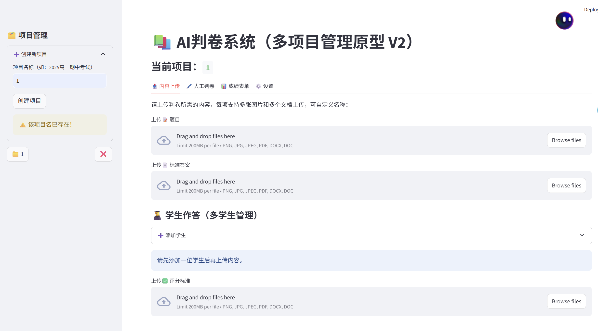
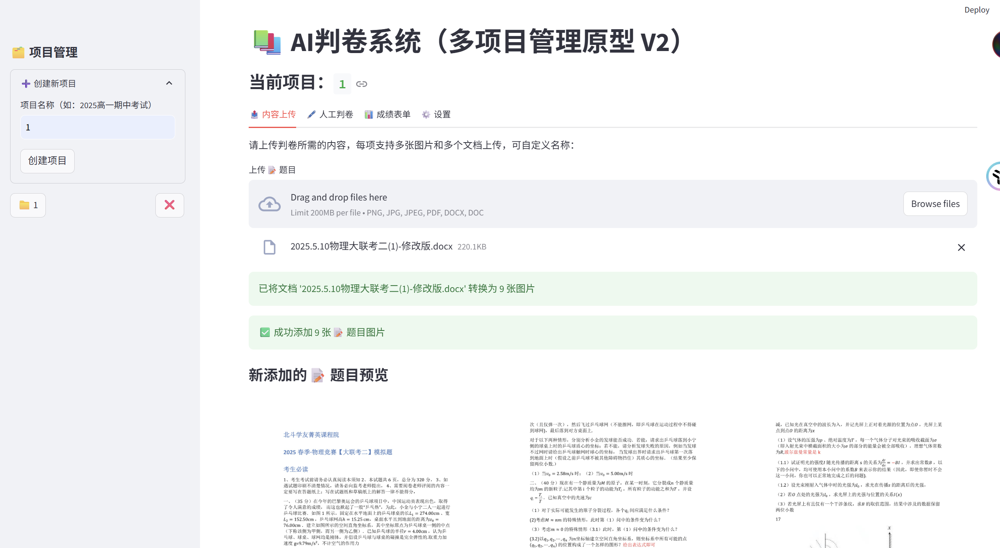
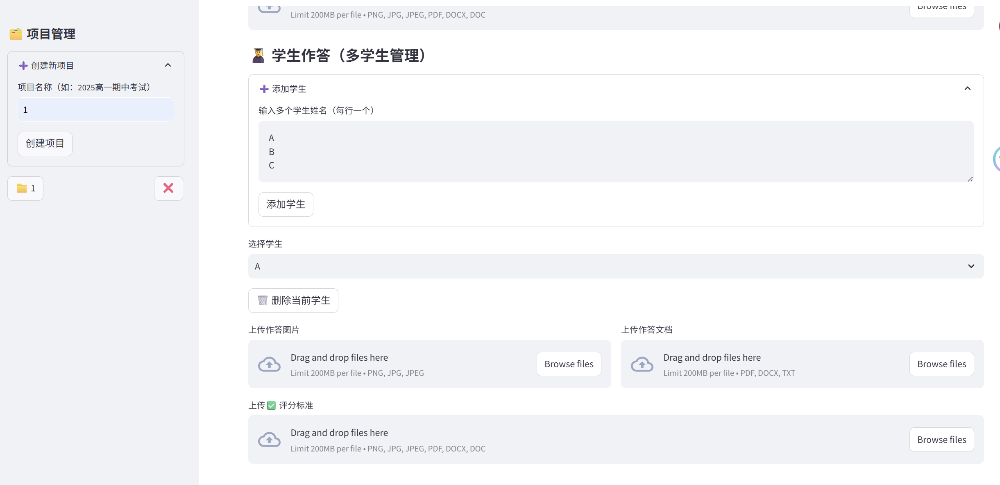
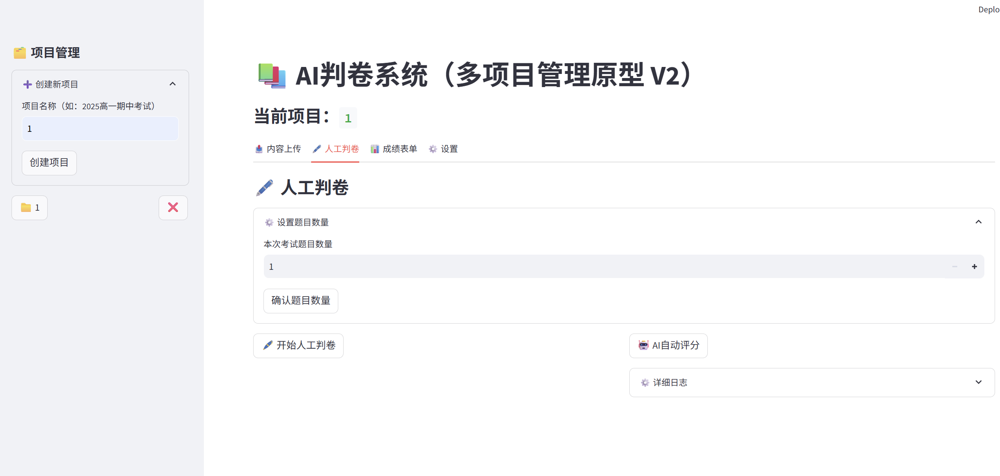
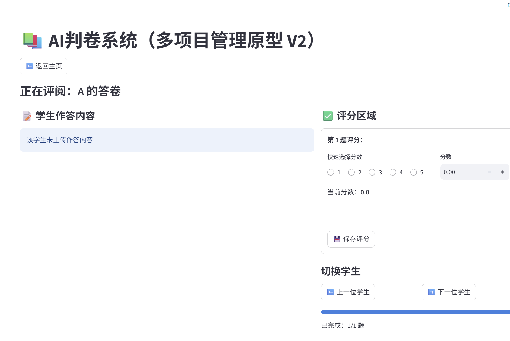
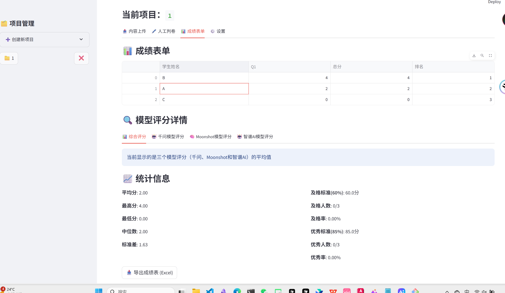
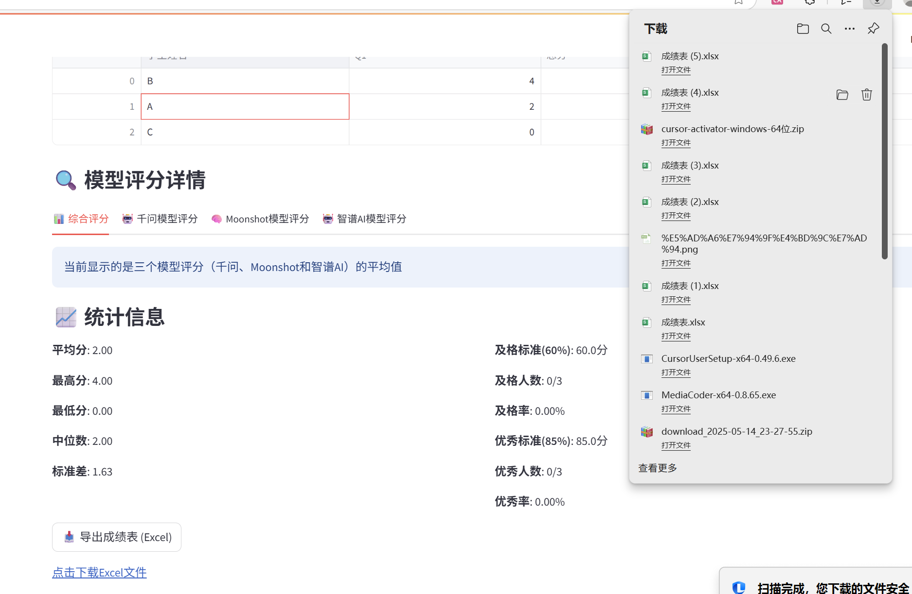
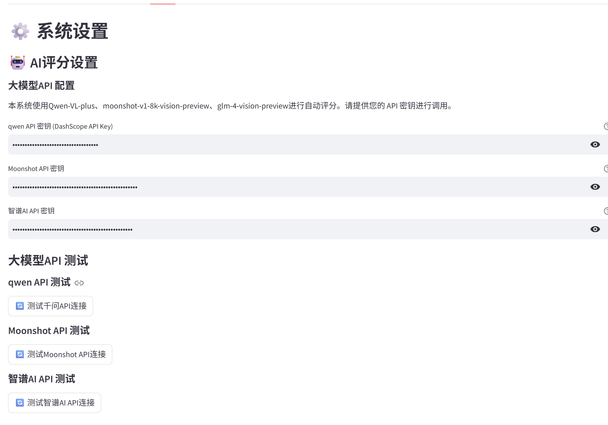

# AI-grading-V2（streamlit实现）
## 概述
我们励志做一个使用AI大模型识别并理解上传的图片或docx/pdf(转换成图片再输入给大模型)，在三个大模型轮流阅卷并返回json值，进行平均值过后就可以得到最后成绩，点击即可生成总成绩excel表格。同时，本系统也可支持手动评分并统计。
## 操作说明
通过点击创建项目自己的项目（由于本项目的大模型能力的限制，最好一道题创建一个项目）

通过点击上传文件或者图片，同时文件也可以转换成图片

添加学生的时候可以回车输入，每行一个学生

可以设置题目数量，同时点击AI自动评分即可图像识别+评分

人工判卷界面，可以把手动选择或输入分数

成绩表单

点击下载excel表格(右上角可以打开文件)

系统设置，填入你的api

## 残余问题
- AI大模型的token有限，所以不能够输入特别长的考试题目或答案文件，AI对长文件的理解能力也会很差，这也是每道题就创建一个项目的原因
- streamlit代码是前后端集成的，效果诚然不如一般的前后端分开，后续准备做成小程序，任重道远
- 界面的功能还不足，还有很大的想象和进步空间
## 操作感悟&加入我
这是我自己独立做的，当然借助了AI编程，但是大部分的代码修改和调试，还有界面的设计和想法都是我一个人做的。这是我第一次进行如此大的工程实践，的确遇到了很多困难，但是也学到了很多东西。
我的qq:2731468336
我的qq邮箱：2731468336@qq.com
我的gmail:2a8nhhhgk@gmail.com
我是即将入学的大一新生，欢迎各位大佬在技术和生活上给我指点。我是一个有梦想且愿意去追逐的人，也是一个愿意把想法付诸实践的人。如果你对我有什么建议或者对项目有什么建议或想法，请联系我，欢迎你的来信！

English:
## Overview
We are determined to use an AI big model to recognize and understand uploaded images or docx/pdf (converted into images and then input into the big model). Three big models will take turns to grade the papers and return json values. After averaging, we can get the final score. Click to generate an excel table of the total score. At the same time, this system can also support manual scoring and statistics.
## Operation Instructions
Create your own project by clicking on it (due to the limitations of the large model capacity of this project, it is best to create one project per question)

Upload files or pictures by clicking, and files can also be converted into pictures

When adding students, you can press Enter to input one student per line

You can set the number of questions and click AI to automatically score for image recognition + scoring

Manual scoring interface, you can manually select or enter the score

Grade form

Click to download the Excel table (you can open the file in the upper right corner)

System settings, fill in your api

## Residual issues
- The AI ​​model has limited tokens, so it cannot input very long test questions or answer files. AI's ability to understand long files is also very poor, which is why a project is created for each question
- The streamlit code is integrated with the front-end and back-end. The effect is not as good as the general front-end and back-end separation. We plan to make it into a small program in the future, but there is still a long way to go.
- The interface is not functional enough, there is still a lot of room for imagination and improvement
## Operation experience & Join me
I did this by myself, with the help of AI programming, but most of the code modification and debugging, as well as the interface design and ideas were done by me alone. This was my first time to carry out such a large-scale engineering practice, and I did encounter many difficulties, but I also learned a lot.
My QQ:2731468336
My QQ email: 2731468336@qq.com
My gmail:2a8nhhhgk@gmail.com
I am a freshman who is about to enter college. I welcome everyone to give me advice on technology and life. I am a person who has dreams and is willing to pursue them, and I am also a person who is willing to put ideas into practice. If you have any suggestions for me or any suggestions or ideas for the project, please contact me. Your letter is welcome!
